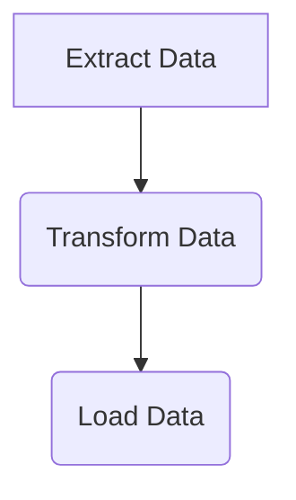
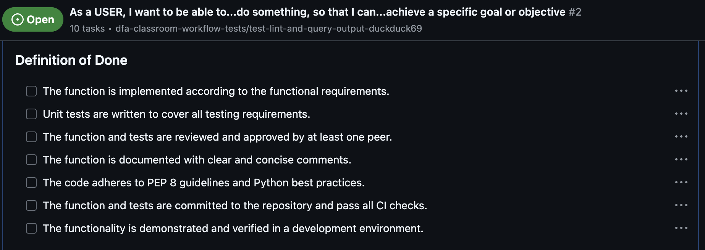
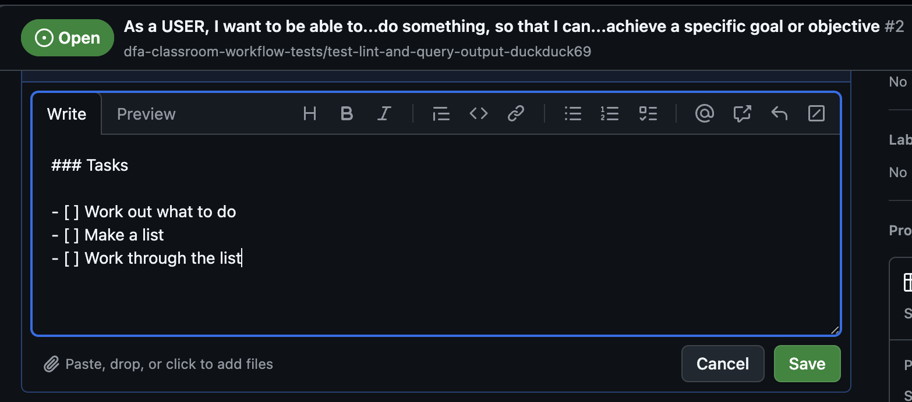
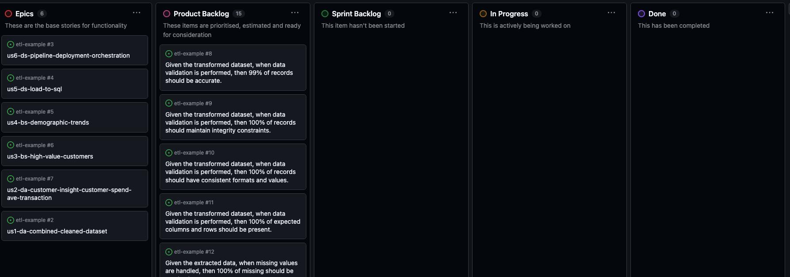

# 

## ETL Pipeline Project Walkthrough

---

<!-- TOC -->

- [](#)
  - [ETL Pipeline Project Walkthrough](#etl-pipeline-project-walkthrough)
  - [Project Requirements](#project-requirements)
  - [Goals](#goals)
  - [Requirements Summary](#requirements-summary)
  - [Fail to Plan...Plan to Fail](#fail-to-planplan-to-fail)
  - [Agile Methodology](#agile-methodology)
    - [Activity 1: Identify the User Stories, Acceptance Criteria and Definition of Done](#activity-1-identify-the-user-stories-acceptance-criteria-and-definition-of-done)
    - [Activity 1 Solution](#activity-1-solution)
  - [Planning the ETL Pipeline](#planning-the-etl-pipeline)
    - [Activity 2: Design the ETL Pipeline and Subprocesses](#activity-2-design-the-etl-pipeline-and-subprocesses)
    - [Activity 2 Solution](#activity-2-solution)
  - [Test Planning](#test-planning)
    - [Activity 3: Plan the Testing Strategy](#activity-3-plan-the-testing-strategy)
    - [Activity 3 Solution](#activity-3-solution)
  - [Breaking the Tasks Down](#breaking-the-tasks-down)
    - [Activity 4: Play a Planning Poker Session](#activity-4-play-a-planning-poker-session)
    - [Activity 4 Solution](#activity-4-solution)
    - [But...What about breaking the user stories down for this project?](#butwhat-about-breaking-the-user-stories-down-for-this-project)
  - [Project Set Up](#project-set-up)
    - [Activity 5: Set Up the Project](#activity-5-set-up-the-project)
  - [Extract Data](#extract-data)
    - [Activity 6: Extract Data](#activity-6-extract-data)

<!-- /TOC -->

---

## Project Requirements

The goal is to build an ETL pipeline that consolidates customer data from two disparate sources to provide a cleaned, enriched dataset for further analysis.

 1. ***Data Sources:***
    - A SQL database (transactions table) that tracks customer purchases.
    - A CSV file (customers.csv) containing demographic details for customers.
 2. ***Challenges:***
    - *The data is unclean:*
      - Missing values (e.g., transaction amounts, customer names).
      - Duplicates in records.
      - Inconsistent formats (e.g., dates, casing, extra spaces).
      - Invalid entries (e.g., invalid numbers, statuses).
      - Some customers in the transaction data may not have demographic information and vice versa.
      - The volume of data is substantial (10,000+ records in transactions and 5,000+ in demographics).
 3. ***Outcome:***
    - Produce a cleaned, joined dataset that includes only active customers and filters out invalid or incomplete records.
    - Enrich the data with calculated metrics, such as:
      - Total customer spending.
      - Average transaction value per customer.
    - Store the cleaned data in a new SQL database table (customer_summary) for analysis.
    - Have an ETL pipeline that can be run regularly to rest or update the dataset with new data.

---

## Goals

1. ***Extract*** *transaction* and *demographic* data from both sources SQL and CSV.
2. ***Transform*** the data to:
   - Join customer transaction data with demographic information.
   - Filter only active customers who have spent more than ***$500*** in total.
   - Add a calculated column for the *average transaction value per customer*.
3. ***Load*** the transformed data into a *new SQL database* table for analysis.
4. **Create a seamless ETL pipeline** that can be run regularly to update the dataset with new data.

---

## Requirements Summary

- Ensure that clean, consolidated customer and transaction data is accessible for analysis.
- Enable analysis of customer spending and behaviour trends to identify key insights.
- Enable analysis of customer demographics to inform marketing and decision-making.
- Ensure the final data meets quality standards and is reliable for decision-making.
- Provide seamless access to the cleaned and enriched data that can be reset or updated as necessary.

---

---

## Fail to Plan...Plan to Fail

The cornerstone of any successful project is planning.  In this walkthrough, we will guide you through the process of planning an ETL pipeline project.  This will include:

1. Identifying the User Stories, Acceptance Criteria and Definition of Done.
2. Designing the ETL Pipeline and Subprocesses.
3. Planning the Testing Strategy.
4. Implementing the code to perform the Extract, Transform and Load (ETL) process, meeting functional and non-functional requirements.
5. Testing the ETL pipeline to ensure that it meets the requirements and is robust.
6. Documenting the process and the code to ensure that it is maintainable and understandable by others.
7. Reviewing the project to ensure that it meets the requirements and is ready for deployment.
8. Deploying the project to a production environment and ensuring that it is operational.

---

## Agile Methodology

The Agile methodology is a popular approach to project management that is used in software development and other industries.  Agile is based on the principles outlined in the Agile Manifesto, which emphasizes:

- **Individuals and interactions** over processes and tools.
- **Working software** over comprehensive documentation.
- **Customer collaboration** over contract negotiation.
- **Responding to change** over following a plan.

Agile projects are typically divided into small increments called ***Sprints***, which are usually 1-4 weeks long.  Each ***Sprint*** focuses on delivering a specific set of features or improvements to the project.  At the end of each ***Sprint***, the team reviews the work completed with the customer, and adjustments to the ***Product Backlog*** can be made.  The team will also have a retrospective to discuss what went well and what could be improved in the next ***Sprint*** in terms of the way the team worked, its tools and practices.

Features, requirements or improvements are typically described in user stories that outline the desired functionality from the perspective of the end user.  User stories are often written in the format:

```plaintext
As a [role], I want [goal/desire] so that [benefit].
```

The ***Product Owner*** is a member of the team.  They are responsible for collaborating with the project stakeholders to define the project requirements and priorities.  The ***Product Owner*** is responsible for maintaining the ***Product Backlog***, which is a prioritised list of all the features, requirements, and improvements that need to be implemented in the project in the form of user stories.  The development team consists of the ***Product Owner***, the ***Scrum Master*** and ***multi-disciplined developers*** (*or engineers*) who are responsible for implementing the project requirements.  The team decide on a ***Definition of Done*** (DOD), which is a common understanding of what it means for a user story to be completed.  The team will also collaborate to create ***Acceptance Criteria*** for each user story, which are specific conditions that must be met for the user story to be considered complete (and usually reflective of the DoD).

Understanding how requirements are turned into user stories is essential and knowing when a story has been refined enough to be considered ready for development is crucial.  The team will also need to understand how to break down the user stories into tasks that can be completed in a sprint.  Estimation is usually done in ***Backlog Refinement*** which can take up to 10% of the team's ***Sprint*** time.

---

### Activity 1: Identify the User Stories, Acceptance Criteria and Definition of Done

1. In the [Activity 1](./walkthough-activities/activity-1.md) document, work with your team to convert the project requirements into user stories.  The 5 goals above translate into 4 ***epics***, these should be broken down into 1 or more user stories, using the format:

```plaintext
As a [role], I want [goal/desire] so that [benefit].
```

2. From the defined ***"Definition of Done"*** in the [Activity 1](./walkthough-activities/activity-1.md) document for the project, work with your team to complete partially written ***"Acceptance Criteria"*** for each user story to ensure that the team meets the project requirements.

---

### Activity 1 Solution

A sample solution for Activity 1 can be found [here](./walkthough-activities/activity-1-solution.md).

---

---

## Planning the ETL Pipeline

Now that we are clear on the requirements, we can start to plan and design the pipeline.  A good place to start is to create a flowchart that outlines the steps in the ETL process, including the data sources, transformations, and the final output.

A tool that can be used to create flowcharts in Markdown is [Mermaid](https://mermaid-js.github.io/mermaid/#/).  To use in VSCode, you will need to install the Mermaid Plug In.  Here is an example of a simple flowchart:



When you are in "Preview" mode for the Markdown document, the flowchart will be rendered.  You can find more information on how to use Mermaid [here](https://mermaid-js.github.io/mermaid/#/).

---

---

### Activity 2: Design the ETL Pipeline and Subprocesses

In [Activity 2](./walkthough-activities/activity-2.md) as outlined in the document, you will think about the process to create the ETL pipeline.

Your team will identify missing labels in the flowchart and subsequent subprocesses to define the whole approach to solving the problem.

---

### Activity 2 Solution

A sample solution for Activity 2 can be found [here](./walkthough-activities/activity-2-solution.md).

---

---

## Test Planning

For testing, you need to remember the different types of tests that you can use to ensure that the code meets the requirements.  These can include:

- Unit Tests
- Integration Tests
- End-to-End Tests
- Regression Tests
- Performance Tests

You should also consider the approach to testing - is the task suitable for Test Driven Development (TDD) or other types of testing approaches, such as:

- Behaviour Driven Development (BDD) - [What is BDD?](https://www.agilealliance.org/glossary/bdd/)
- Acceptance Test Driven Development (ATDD) - [What is ATDD?](https://www.agilealliance.org/glossary/atdd/)
- Exploratory Testing - [What is Exploratory Testing?](https://www.agilealliance.org/glossary/exploratory-testing/)

As part of an Agile process and any sound project planning and strategy development, it is wise to consider how you know the team is being successful!  The "Definition of Done" is a good place to start and identifying test cases and how you will demonstrate that the test cases help demonstrate that the acceptance criteria and the DoD are met!  This is then put onto each user story card as a checklist of tasks to be completed.

> Here is an example of a Definition of Done for a user story, recorded on a GitHub issue card (which are often used as user story cards in Agile projects):



It is usual to define a list of test cases and include them in the description of the user story on the card on the Agile board.  This helps to ensure that the team is clear on what is expected and what is required to be successful.

---

### Activity 3: Plan the Testing Strategy

In [Activity 3](./walkthough-activities/activity-3.md) as outlined in the document, you will think about the tests needed for one of the user stories.  User Story 1 is walked through in the document, then you should work on the next one following the same pattern.

You team will define the type of tests required, the test cases and how you will know that the tests have been successful is key to ensuring that each user story meets the requirements and can be considered "Done".

---

### Activity 3 Solution

A sample solution for Activity 3 can be found [here](./walkthough-activities/activity-3-solution.md).

---

---

## Breaking the Tasks Down

Now that we have some user stories, a high-level plan and a testing strategy, we can start to work out what the tasks are for each user story.  These are usually detailed in the user story card as a checklist, along with the test cases.  In fact, the test cases can be used to help define the tasks.  This is the final step before we actually start coding the solution.

> A checklist is often added to the user story card to list the tasks.  In some cases, the "Definition of Done" will suffice, but it is often useful to decompose the DoD into a checklist of tasks that are specific to the user story.  
>
> These are done by creating a markdown checklist in the description of the user story card on the Agile board.



As we have done a lot of work on identifying the Acceptance Criteria, it seems for this project that we already have our task list for each user story.  This is a good example of how the Acceptance Criteria can be used to define the tasks for the user story.

However, after working on what we thought the individual user stories are, we can see that there is quite a lot of work required for each to meet the Acceptance Criteria.  Essentially, here, we are in a ***"Product Backlog Refinement"*** process.

***Product Backlog Refinement*** is not defined as an event in the Agile process but is essential for it to work effectively.  Remember the goal of Agile is to create ***quality working software on a regular basis***.  We need to make sure that we can get ***stuff*** done in a ***Sprint***.  It would be remiss of the team to take work into a sprint backlog if they are not confident that the work will be ***done*** by the end of the spring.  This is why ***Product Backlog Refinement*** is so important.  It reduces the risk that the team will not be able to complete the work in the sprint.  Part of this process is to estimate the work that needs to be done.  This is often done in ***Story Points***.  The team will need to agree on what a ***Story Point*** is and then estimate the work in ***Story Points***.  This is often done in ***Planning Poker*** sessions.

> ***Planning Poker*** is a consensus-based, gamified technique for estimating, mostly used to estimate effort or relative size of development goals in software development. In ***Planning Poker***, members of the group make estimates by playing numbered cards face-down to the table, instead of speaking them aloud. The cards are revealed, and the estimates are then discussed. By hiding the figures in this way, the group can avoid the cognitive bias of anchoring, where the first number spoken aloud sets a precedent for subsequent estimates.
>
> Read more [here](https://www.mountaingoatsoftware.com/agile/planning-poker)
>
> Set up a "free" ***Planning Poker*** session [here](https://planningpokeronline.com/)

---

### Activity 4: Play a Planning Poker Session

Your trainer will supply you with a link for a Planning Poker game, based around a non-technical backlog.

---

### Activity 4 Solution

No solution required here.  Your trainer will guide you through the process.

---

### But...What about breaking the user stories down for this project?

The user stories we have are definitely more ***EPIC*** like.  They are also interdependent and some cannot be completed before others.  This is where the ***Product Owner*** will have refined the backlog and prioritised the order.  This is done in consultation with the external stakeholders and the development team.  However, we need to make sure that we can complete tasks on a daily basis so that the team can report back in the ***Daily Stand Up*** meeting.

It seems reasonable to break the user stories down into each of the Acceptance Criteria (or grouped Acceptance Criteria).  Each of the test criteria for the acceptance criteria then becomes a task. These will be recorded on their own card.

Commerical software is usually used to manage the backlog - the most common of these being Atlassian's Jira.  It has many tools that allow for the management of the backlog, sprint planning, sprint management and reporting.  It integrates with many other tools, such as GitHub, Slack and Confluence, allowing teams to work in a collaborative way.

For this project, we have a GitHub repository and we can use GitHub Projects, Issues and Milestones to see how these can be used to simulate the more commonly used features of Jira.

[Example Project](https://github.com/orgs/Digital-Futures-Academy-DE-Curriculum/projects/3/views/1)

> NB: This link may not work if you are not a member of the **Digital-Futures-Academy-DE-Curriculum** organisation
>
> Below is an example of how the project is set up in GitHub Projects:



---

## Project Set Up

Now that we have a plan, we can start to set up the project.  This will include:

1. Setting up the project structure.
2. Setting up production, test and development environments.
3. Installing the required dependencies.
4. Creating the necessary files and folders to allow testing, linting and running the project.

For the purposes of this walkthrough, we will also need to have access to the data sources.  These are provided in the `data-for-demo` folder.  The data sources are:

- `unclean_customers.csv`
- `unclean_transactions.db` (here as reference from an SQLite version of the database)
- `unclean_transactions.sql`

To make sure that the project will work on the architecture available, we need to use the same flavour of database as the actual data source.  In this case, the customer's systems use PostgreSQL.  

For development and initial testing purposes, we will install a local version of the databases.

> ***You will need to download and install PostgreSQL:***
>
> For Mac, you can install using ***Homebrew*** using the command:
>

```bash
brew install postgresql
```

> For Windows, you can download the installer from the [PostgreSQL website](https://www.postgresql.org/download/).
>
> Make sure that you follow the instructions to set up the database and create a user - these should include:
>
> - Setting up a user with a password - use `postgres` as the user and `password` as the password.
> - Add PostgreSQL to the system path - (e.g., `C:\Program Files\PostgreSQL\13\bin` is added to your system's `PATH` environment variable)
>
> On both system types:
>
> - Verify the installation with the command `psql --version`
>

---

### Activity 5: Set Up the Project

In [Activity 5 (Solution)](./walkthough-activities/activity-5-solution.md) as outlined in the document, you will be walked through the process of setting up the project, including creating the folder structure, installing the initial dependencies and setting up the testing environment.

This process is labour intensive and can take some time to complete.  Generally, you may not be involved in this part of the process but it is important to understand how it is done.  This walkthrough uses general best practices but each organisation will have its own standards, practices and preferred dependencies, tools and environments.  Ultimately, the project will meet the requirements whichever way it is set up!

After the walkthrough, you should be able to run the project and see an initial output along with the tests that have been set up.  You will also be able to see the linting that has been set up.

Your team's task is to write a PROJECT_README.md file that can be used by other developers to set up the project on their local machines.  This will include the steps to set up the project, the dependencies required and how to run the project.

---

---

## Extract Data

We made it!  We're now ready to start coding the solution.  However, we should not forget all of the work we did in the planning phase.  We need to make sure that we go and review the highest priority user story and the sub-tasks we identified.  Remember that these sub-tasks were generated from the Acceptance Criteria and to help us meet the Definition of Done.  They also formed the basis of the test cases, so we can use TDD to help use code each part of the solution where the expected outcomes are known.

---

### Activity 6: Extract Data

In [Activity 6](./wlakthrough-activities/activity-6.md), you will be walked through the first part of the process of extracting data from the datasources.  Your team will then take on the responsibility of completing the extraction processes.

---
