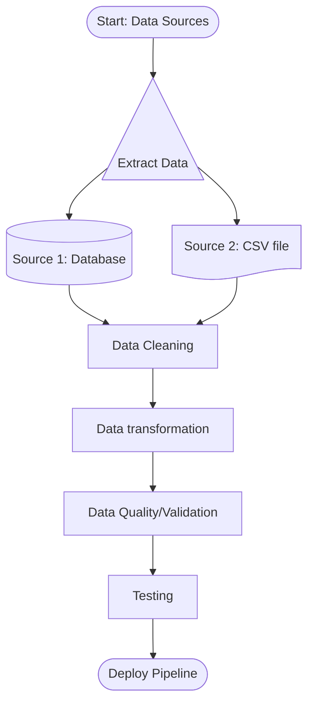
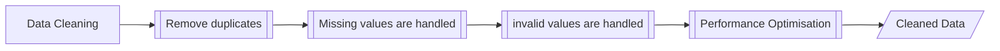
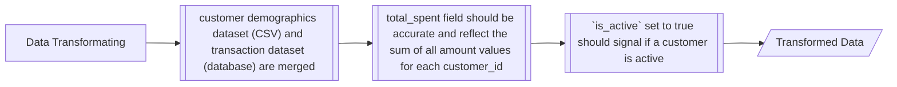
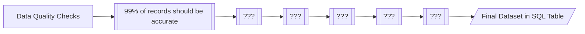

# 

## ETL Pipeline Project Walkthrough

## Activity 2 ETL Pipeline High-Level Plan and Subprocesses

### Activity 2.1 - High-Level Flowchart

Identify the missing steps in the high-level flowchart.  Preview the document to see flowchart, edit the `label` key to add the missing steps.

---

### Activity 2.2 - ??? Subprocesses

Identify the missing subprocesses in the data cleaning flowchart.  Preview the document to see flowchart, edit the `label` key to add the missing subprocesses.

---

## Activity 2.3 - Data Transformation Subprocesses

Identify the missing subprocesses in the data transformation flowchart.  Preview the document to see flowchart, edit the `label` key to add the missing subprocesses.

---

## Activity 2.3 - Loading Subprocesses

Identify the missing subprocesses in the loading flowchart.  Preview the document to see flowchart, edit the `label` key to add the missing subprocesses.

---

## Deployment Subprocesses

This will be covered later in the project walkthrough.

---

---
