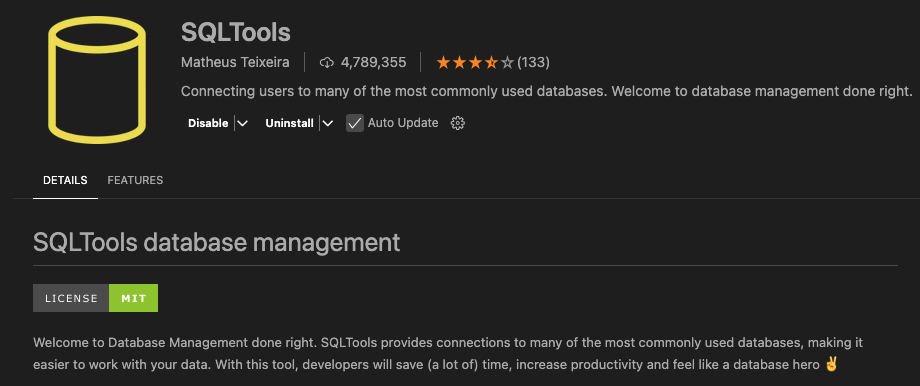
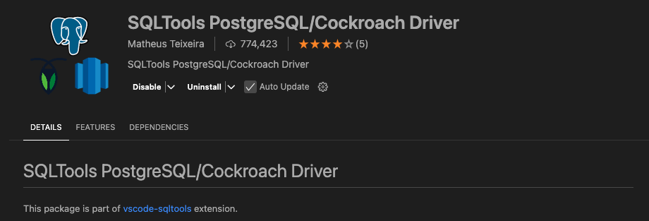
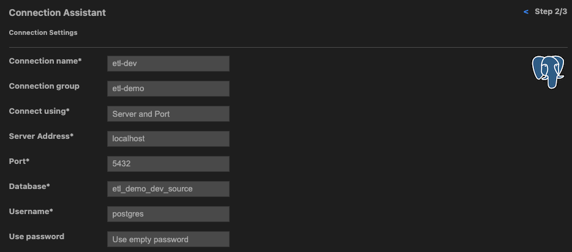

# 

## ETL Pipeline Project Walkthrough

---

---

## Activity 5: Project Set Up

1. Setting up the project structure.
2. Setting up production, test and development environments.
3. Installing the required dependencies.
4. Creating the necessary files and folders.

---

### Step 1: Setup the Project Structure

```plaintext
etl-example/
├── config/
│   ├── __init__.py
│   └── db_config.py
├── data/
│   ├── output/
│   ├── processed/
│   └── raw/
├── docs/
│   └── flowcharts/
│       └── etl_flowchart.md
├── etl/
│   ├── extract/
│   │   ├── __init__.py
│   │   ├── extract.py
│   ├── load/
│   │   ├── __init__.py
│   │   ├── load.py
│   ├── sql/
│   ├── transform/
│   │   ├── __init__.py
│   │   ├── transform.py
│   └── __init__.py
├── notebooks/
│   └── exploratory_analysis.ipynb
├── scripts/
│   ├── __init__.py
│   └── run_etl.py
├── tests/
│   ├── __init__.py
├── .env
├── .env.dev
├── .env.test
├── .gitignore
├── README.md
├── requirements-setup.txt
├── requirements.txt
└── setup.py
```

Explanation of Folders and Files

- ***config/***: Contains configuration files and scripts:
  - **\_\_init\_\_.py**: An empty file to make this directory a Python package.
  - **db_config.py**: A Python script for database configuration and connection setup.
- ***data/***: Contains data files.
  - ***output/***: Stores final output data files that are ready for analysis.
  - ***processed/***: Stores intermediate data files that have been processed.
  - ***raw/***: Stores raw data files (e.g., CSV files) that are extracted from the source.
- ***docs/***: Contains documentation files.
  - ***flowcharts/***: Stores flowcharts and diagrams related to the ETL process.
    - **etl_flowchart.md**: A markdown file containing the ETL flowchart created using Mermaid.
- ***etl/***: Contains the main ETL scripts.
  - **\_\_init\_\_.py**: An empty file to make this directory a Python package.
  - ***extract/***: Contains scripts for data extraction.
    - **\_\_init\_\_.py**: An empty file to make this directory a Python package.
    - **extract.py**: Contains functions for data extraction from various sources.
  - ***load/***: Contains scripts for data loading
    - **\_\_init\_\_.py**: An empty file to make this directory a Python package.
    - **load.py**: Contains functions for loading data into the target database.
  - ***sql/***: Will contain SQL scripts for extracting data from and loading data to databases.
  - ***transform/***: Contains scripts for data transformation.
    - **\_\_init\_\_.py**: An empty file to make this directory a Python package.
    - **transform.py**: Contains functions for data transformation and cleaning.
- ***notebooks/***: Folder for any Jupyter notebooks for exploratory data analysis and prototyping.
- ***scripts/***: Contains scripts for running the ETL pipeline.
  - **\_\_init\_\_**.py: An empty file to make this directory a Python package.
  - **run_etl.py**: A script to run the entire ETL pipeline - calls `extract` -> `transform` -> `load` from the appropriate Python script.
- ***tests/***: Contains test scripts for unit testing and performance testing.
  - **\_\_init\_\_**.py: An empty file to make this directory a Python package.
- **README.md**: A markdown file that provides an overview of the project, setup instructions, and usage guidelines.
- **requirements-setup.txt**: Contains a list of required Python packages to be able to use **setup.py** to install the project.
- **requirements.txt**: Contains a list of required Python packages to be able to use **setup.py** to install the project.
- **setup.py**: A setup script for installing the project as a package.

> Walkthrough Files and Folders
>
> These would not usually be included in a project, but are included here for the purpose of the walkthrough.

```plaintext
├── walkthrough-activities-/
├── walkthrough-docs/
├── walkthrough-data/
│   ├── unclean_customers.csv
│   ├── unclean_transactions.db
│   ├── unclean_transactions.sql
```

---

### Step 2: Set Up the Environments

#### 2.1. Create `.env.xxx` Files

Create two environment files: `.env.dev` and `.env.test`.

```bash
# Development Environment Variables

# Source Database Configuration
SOURCE_DB_NAME=etl_demo_dev_source
SOURCE_DB_USER=postgres
SOURCE_DB_PASSWORD=
SOURCE_DB_HOST=localhost
SOURCE_DB_PORT=5432

# Target Database Configuration
TARGET_DB_NAME=etl_demo_dev_source
TARGET_DB_USER=postgres
TARGET_DB_PASSWORD=
TARGET_DB_HOST=localhost
TARGET_DB_PORT=5432
```

```bash
# Source Database Configuration
SOURCE_DB_NAME=etl_demo_test_source
SOURCE_DB_USER=postgres
SOURCE_DB_PASSWORD=
SOURCE_DB_HOST=localhost
SOURCE_DB_PORT=5432

# Target Database Configuration
TARGET_DB_NAME=etl_demo_test_source
TARGET_DB_USER=postgres
TARGET_DB_PASSWORD=
TARGET_DB_HOST=localhost
TARGET_DB_PORT=5432
```

At this point, we don't know details of the Production Environment, so we will not create a `.env` file.

> ***NOTE***: It is actually unlikely that we'll ever have a `.env` file in a production environment. Instead, we would set environment variables directly on the server that will build and run the ETL pipeline.

---

#### 2.2 Create a Python .venv

Create a Python virtual environment and install the required packages.

```bash
python3 -m venv .venv
source .venv/bin/activate       # On Windows, use .venv\Scripts\activate
pip install -r requirements.txt
```

---

#### 2.3 Create the Development and Test Source Databases

Create the development and test source databases by running the following commands on the terminal (given you have successfully installed Postgres!):

```bash
psql -U postgres -c "CREATE DATABASE etl_demo_dev_source;"
psql -U postgres -c "CREATE DATABASE etl_demo_test_source;"
```

---

#### Optional: Install the VSCode SQL Tools Extension

Install the following extension in VSCode to be able to run SQL queries directly from the editor:

- **SQLTools**: A database management tool for VSCode.



To be able to use PostgreSQL with SQLTools, you will need to install the following extension:

- **SQLTools PostgreSQL Driver**: A PostgreSQL driver for SQLTools.



Connect to the etl_demo_dev_source and etl_demo_test_source databases using the SQLTools extension:

1. Click on the SQLTools icon in the sidebar.
2. Click on the `+` icon to add a new connection.
3. Select PostgreSQL as the database type.
4. Enter the connection details for the development and test databases.
5. Click on the `Test Connect` button to check the connection.
6. If successful, click `Save Connection`.
7. You can now run SQL queries directly from the editor.



---

#### Step 2.4: Populate the Development Database

Populate the development database with the sample data provided in the `walkthrough-data` folder (using the **unclean_transactions.sql** file).

```bash
psql -U postgres -d etl_demo_dev_source -f walkthrough-data/unclean_transactions.sql
```

***Optionally, using VSCode Extension - although this seems to be a frustrating way!***

1. Click on the SQLTools icon in the sidebar.
2. Click on the `etl_demo_dev_source` connection.
3. Open the **unclean_transactions.sql** file.
4. Right click anywhere in the code window and select `Attach Connection To This File`.
5. Wait for the connection to be attached - signified by options to run the code appearing below the file tabs t.
6. Click on `Run on Active Connection` and wait for the query to finish running

---

### Step 3: Install the Required Dependencies

Use `pip install` to install the required dependencies.

For working with different environment variables:

- `python-dotenv`: A Python library for working with environment variables.

For Connecting to PostgreSQL databases:

- `psycopg2`: A PostgreSQL adapter for Python.

For Cleaning and Transforming Data:

- `pandas`: A powerful data manipulation library.

For Testing:

- `pytest`: A testing framework for Python.
- `pytest-cov`: A plugin for pytest that generates coverage reports.
- `pytest-mock`: A plugin for pytest that provides a mock fixture.
- `pytest-postgresql`: A plugin for pytest that provides a PostgreSQL fixture for testing.

For Linting and Code Formatting:

- `flake8`: A tool for linting Python code.
- `sqlfluff`: A SQL linter and formatter.

We may well add more as we go but here is the complete install command for now:

```bash
pip install python-dotenv psycopg2 pandas pytest pytest-cov pytest-mock pytest-postgresql flake8 sqlfluff
```

Freeze the requirements to the `requirements.txt` file:

```bash
pip freeze > requirements.txt
```

Run the project setup script to install the project as a package:

```bash
pip install -e .
```

The `-e` flag is used to install the project in "editable" mode, which means that changes to the source code will be reflected in the installed package without needing to reinstall it.

> NB: The .venv folder will not be included in the project repository and therefore the dependencies will need to be installed every time the project is cloned.  
> Since we are going to be writing a script to automate the running of the pipeline, the **setup.py** file will be used to install the project as a package.
>
> On a clean clone of the project in this state, only the following commands will be needed to set up the project:
>
> ```bash
> python3 -m venv .venv
> source .venv/bin/activate
> pip install -r requirements-setup.txt
> pip install -e .
> ```

---

### Step 4: Create the Necessary Files and Folders

#### 4.1: Create the `db_config.py` File

Create a `db_config.py` file in the `config/` folder to store the database configuration details.

The file is included in the repo, here is an overview.

`dotenv` allows us to load the environment variables from the `.env.xxx` files.

***Line 16*** uses Python's `os` module ascertain the value of the `ENV` environment variable, if it is not found then `dev` is used by default.

```python
env = os.getenv('ENV', 'dev')
```

***Line 19*** determines which environment variables to load based on the value of the `ENV` variable.

```python
env_file = f'.env' if env == 'prod' else f'.env.{env}'
```

***Line 20*** uses `dotenv`'s `load_dotenv` function to load the environment variables from the appropriate file.

```python
load_dotenv(env_file)
```

When we run the project, we will prefix the command with the environment variable we want to use.

```bash
ENV=dev run_etl
```

This command would set the `ENV` to be `dev` and use the `.env.dev` file to load the environment variables.

```bash
ENV=test run_etl
```

This command would set the `ENV` to be `test` and use the `.env.test` file to load the environment variables.

```bash
ENV=prod run_etl
```

This command would set the `ENV` to be `prod` and use the `.env` file to load the environment variables.

The dictionary is then populated with the values held in the appropriate environment file to establish which of the databases to connect to.

There is a unit test that checks that the correct values are loaded from the `.env` files.

---

<!-- 
#### 4.2: Set Up Pytest, Coverage, Unit, Component, Integration and Performance Testing

Look in the `tests` folder and you should find a file called `run_tests.py`.  The purpose of this file to allow the running of different types of tests as well as a full test run.

Each `pytest` run is prefixed with the environment variable `ENV` to ensure the correct environment variables are loaded and coverage is calculated for the files tested.

-->

<!-- TODO: Add config for performance testing -->
<!-- TODO: Add linting config -->
