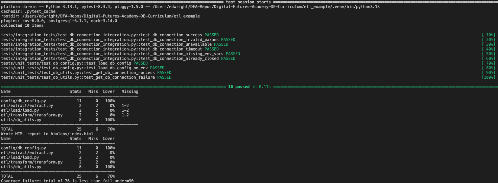

# 

## ETL Pipeline Project Walkthrough

---

---

## Activity 6: Extract Data

In this activity, you will extract data from the source and load it into a pandas DataFrame, bearing in mind the User Story, Sub-Tasks, Acceptance Criteria and the Definition of Done.

---

## User Story

```txt
As a Data Analyst,   
I want access to a single, clean, and accurate dataset combining customer demographics and transaction data,   
So that I can analyze customer behaviour without worrying about data inconsistencies and can rely on it for analysis without manual checks.
```

## Definition of Done

### Code Quality

- Code follows the project's coding standards and best practices.
  - ***SQL***:
    - **Query Performance**: Queries should execute in less than 2 seconds for typical operations.
    - **Readability and Maintainability**: Queries should be formatted for readability with consistent indentation, meaningful aliases, and comments.
    - **Use of Best Practices**: Follow best practices such as avoiding `SELECT *`, using `JOIN`s appropriately, and ensuring proper *indexing*.
    - **Linting**: SQL code should be linted for syntax errors and compliance with best practices.
  - ***Python***:
    - **PEP 8 Compliance**: Code should follow PEP 8 guidelines. Use a linter (e.g., flake8) to ensure compliance.
    - **Code Readability**: Use meaningful variable names, consistent indentation, and comments to explain complex logic.
    - **Modularity**: Functions and classes should be used to encapsulate logic and promote reuse.
    - **Error Handling**: Use `try-except` blocks to handle exceptions and provide meaningful error messages.
  - ***Pandas***:
    - **Efficient Data Manipulation**: Use vectorised operations instead of loops for data manipulation.
    - **Memory Usage**: Use appropriate data types and avoid loading unnecessary data into memory.
    - **Data Validation**: Check for missing values, data types, and data ranges before performing operation
- Code is reviewed and approved by at least one other team member.
- Code is free of critical and high-severity bugs.

---

### Testing

- **Unit tests** are written and cover all new functionality.
- **Integration tests** are written and cover interactions between components.
- **Component tests** are written and validate individual parts of the system.
- All tests pass successfully.
- ***Test coverage*** meets the the ***90%*** threshold for the project.

---

### Documentation

- Code is documented with clear and concise comments.
- User-facing documentation is updated to reflect new or changed functionality.
- Any relevant diagrams or flowcharts are updated.

---

### Performance

- Performance benchmarks are met (e.g., data extraction and cleaning times are within acceptable limits).
  - **Database Extraction**: *Less than 1 minute* for *10,500 rows* with *4 fields*.
  - **CSV Extraction**: *Less than 30 seconds* for *5,200 rows* with *5 columns*.
  - **Data Cleaning**: *Less than 1 second* per *1,000 rows*.
  - **Data Transformation**: *Joins* and *aggregations* take *less than 5 seconds* per *10,000 rows*.
  - **Data Loading**: *Less than 5 seconds* per *10,000 rows*.
  - **End-to-End Processing**: The entire ETL process *completes within 30 minutes* for a full dataset.
  - No significant performance regressions are introduced.

---

### Data Quality

- Data is validated for accuracy, completeness, and consistency.
  - **Accuracy**: *99%* of records are accurate.
  - **Completeness**: *100%* of expected columns and rows are present.
  - **Consistency**: *100%* of records have consistent formats and values.
  - **Integrity**: *100%* of records maintain integrity constraints.
  - **Error Rate**: *Less than 1%* error rate.
  - **Validation Time**: *Less than 1 second* per *1,000 rows*.
- Data cleaning rules are applied, and logs are generated for any issues encountered.
  - **Duplicate Removal Rate**: *100%* of duplicates removed (e.g., 0% duplicates remain).
  - **Null Handling Rate**: *100%* of missing or invalid fields resolved.
  - **Data Completeness**: *100%* of *expected* *columns* and *rows* are present.
  - **Data Consistency**: *100%* of records have consistent formats.
  - **Cleaning Time**: *Less than 1 second* per *1,000 rows*.
  - **Error Rate**: *Less than 1%* error rate.
- Data transformation logic is verified and tested.

---

### Deployment

- Code is deployed to the appropriate environment (e.g., staging, production).
- Deployment scripts and configurations are updated as needed.
- Deployment is verified and tested in the target environment.

---

### Acceptance Criteria

- All acceptance criteria for the user story are met.
- The user story is demonstrated to and accepted by the product owner or relevant stakeholders.

---

### Metrics and Monitoring

- Relevant metrics (e.g., record count accuracy, extraction performance) are collected and reviewed.
- Monitoring and alerting are set up for critical components.

---

### Compliance

- All work complies with relevant legal, regulatory, and security requirements.

---

---

## User Story Acceptance Criteria

### Data Extraction

- Given the database contains 10,500 rows with 4 fields, when the data is extracted, then it should complete in less than 1 minute. #16
- Given the CSV file contains 5,200 rows with 5 columns, when the data is extracted, then it should complete in less than 30 seconds. #17

### Data Cleaning

- Given the extracted data, when duplicates are removed, then 100% of duplicates should be removed. #14
- Given the extracted data, when missing values are handled, then 100% of missing should be resolved. #12
- Given the extracted data, when invalid values are handled, then 100% of invalid fields should be resolved. #13
- Given the extracted data, when data cleaning is performed, then it should complete in less than 1 second per 1,000 rows. #15

### Data Transformation

- Given the cleaned data, when the customer demographics dataset (CSV) and transaction dataset (database) are merged, then the merge should be performed correctly using the customer_id field as the key. #18
- Given the cleaned data, when calculating the total amount spent by each customer, then the total_spent field should be accurate and reflect the sum of all amount values for each customer_id. #20
- Given the cleaned data, when filtering for active customers, then only customers with is_active set to True should be included. #19

### Data Quality

- Given the transformed dataset, when data validation is performed, then 99% of records should be accurate. #8
- Given the transformed dataset, when data validation is performed, then 100% of expected columns and rows should be present. #11
- Given the transformed dataset, when data validation is performed, then 100% of records should have consistent formats and values. #10
- Given the transformed dataset, when data validation is performed, then 100% of records should maintain integrity constraints. #9
- Given the transformed dataset, when data validation is performed, then it should complete in less than 1 second per 1,000 rows. advanced-sql#20

### Documentation - User Story 1 #22

- Code should be documented with clear and concise comments.
- User-facing documentation should be updated to reflect new or changed functionality.

### Testing Acceptance Criteria - User Story 1 #21

- Unit tests should cover all new functionality.
- Integration tests should cover interactions between components.
- All tests should pass successfully.
- Test coverage should meet the project's required threshold of 90%.

---

#### What's the Plan?

1. Extract data from the source.
2. Load the data into a pandas DataFrame.
3. Verify the data extraction process.
4. Document the data extraction process.

---

#### How do we Execute the Plan?

1. Extract data from the source.
   - Connect to the database.
   - Write a SQL query to extract the data.

---

#### What do we Need to Test?

Let's refer the the Acceptance Criteria checklists:

```txt
Given the database contains 10,500 rows with 4 fields,  
when the data is extracted,  
then it should complete in less than 1 minute.
```

- ***Performance Test***:
  - [ ] - Verify that the data extraction completes in less than 1 minute (regardless of the number of rows).
- ***Functional Tests***:
  - [ ] - Verify that the data extraction retrieves exactly 4 fields per row.
- ***Data Integrity Tests***:
  - [ ] - Verify data consistency between the extracted data and the source database.
  - [ ] - Verify data accuracy for a sample of rows.
- ***Reliability Tests***:
  - [ ] - Verify that the code handles a database connection error gracefully
  - [ ] - Verify that the code handles a database query error gracefully
  - [ ] - Verify that the code handles a database timeout error gracefully
- ***Code Quality Tests***:
  - [ ] - SQL queries pass linting and formatting checks.
  - [ ] - Python scripts pass linting and formatting checks.
  - [ - ] Test coverage on the database extraction script is at least 90%.

---

#### What do we Already Know?

1. The database connection details - supplied by the `db_config.py` file.
2. Extract all fields and rows from the transactions table in the database.
3. The expected number of rows and fields in the database.
4. The expected time for data extraction.

---

#### Test-Driven Development Opportunities

Let's think about the functionality of the code and what we expect.

In connecting the database, our previous experience is that we need to use a library call to `connect` to the database and that we will return some form of `connection` object.

We also know that the `connect` function requires some details of the database to connect to, so we can write a test that asserts that the `connect` function is called as part of our database connection function.

The second thing we can assert here is that our function returns the connection object created by the `connect` function.

In the first instance, we can now test drive a ***unit test*** for creating a database connection, where we will mock the `connect` function and it's return.

> Remember:
>
> Test-driven development has 3 rules:
>
> 1. You are not allowed to write any production code unless it is to make a failing unit test pass.
> 2. You are not allowed to write any more of a unit test than is sufficient to fail, and compilation failures are failures.
> 3. You are not allowed to write any more production code than is sufficient to pass the one failing unit test.

```python
from unittest.mock import patch, MagicMock
from utils.db_utils import get_db_connection


def test_get_db_connection(mocker):
    connection_params = {
        'dbname': 'test_db',
        'user': 'test_user',
        'password': 'test_password',
        'host': 'test_host',
        'port': 'test_port'
    }

    mock_connection = MagicMock()
    mock_connect = mocker.patch('psycopg2.connect', return_value=mock_connection)

    connection = get_db_connection(connection_params)

    mock_connect.assert_called_once_with(**connection_params)
    assert connection == mock_connection
```

Once the test is written and failing (as we haven't written the `get_db_connection` function yet), we can write the function to make the test pass.

```python
import psycopg2


def get_db_connection(connection_params):
    return psycopg2.connect(**connection_params)
```

#### Error Conditions

And then we should consider error conditions.  What happens if:

- The connection details are incorrect?
- The database is not available?
- The database is not accepting connections?
- The connection times out?

```python
# Production Code
import psycopg2

class DatabaseConnectionError(Exception):
    pass


def get_db_connection(connection_params):
    try:
        return psycopg2.connect(**connection_params)
    except psycopg2.Error as e:
        raise DatabaseConnectionError(f"Failed to connect to the database: {e}")


# Test Code
import pytest
import psycopg2
from unittest.mock import patch, MagicMock
import logging
from utils.db_utils import get_db_connection, DatabaseConnectionError


def test_get_db_connection_success(mocker):
    connection_params = {
        'dbname': 'test_db',
        'user': 'test_user',
        'password': 'test_password',
        'host': 'test_host',
        'port': 'test_port'
    }

    mock_connection = MagicMock()
    mock_connect = mocker.patch('psycopg2.connect', return_value=mock_connection)
    mock_logger = mocker.patch('db_utils.logging.getLogger')

    connection = get_db_connection(connection_params)

    mock_connect.assert_called_once_with(**connection_params)
    assert connection == mock_connection
    mock_logger().info.assert_called_once_with("Successfully connected to the database.")


def test_get_db_connection_failure(mocker):
    connection_params = {
        'dbname': 'test_db',
        'user': 'test_user',
        'password': 'test_password',
        'host': 'test_host',
        'port': 'test_port'
    }

    mock_connect = mocker.patch('psycopg2.connect', side_effect=psycopg2.Error("Connection error"))

    with pytest.raises(DatabaseConnectionError) as excinfo:
        get_db_connection(connection_params)

    assert str(excinfo.value) == "Failed to connect to the database: Connection error"
    mock_connect.assert_called_once_with(**connection_params)

```

#### Logging

Let's look back at Definition of Done - Logging and Monitoring are set up for critical components.  We should consider logging these errors to a file for the time being.

```markdown
### Metrics and Monitoring

- Relevant metrics (e.g., record count accuracy, extraction performance) are collected and reviewed.
- Monitoring and alerting are set up for critical components.
```

```python
import psycopg2
import logging

# Configure logging
logging.basicConfig(filename='db_connection.log', level=logging.INFO, 
                    format='%(asctime)s - %(name)s - %(levelname)s - %(message)s')

class DatabaseConnectionError(Exception):
    pass


def get_db_connection(connection_params):
    logger = logging.getLogger(__name__)
    try:
        connection = psycopg2.connect(**connection_params)
        logger.info("Successfully connected to the database.")
        return connection
    except psycopg2.Error as e:
        logger.error(f"Failed to connect to the database: {e}")
        raise DatabaseConnectionError(f"Failed to connect to the database: {e}")
```

This will also require tests to be refactored slightly too.

```python
import pytest
import psycopg2
from unittest.mock import patch, MagicMock
import logging
from utils.db_utils import get_db_connection, DatabaseConnectionError

@pytest.fixture
def connection_params():
    return {
        'dbname': 'test_db',
        'user': 'test_user',
        'password': 'test_password',
        'host': 'test_host',
        'port': 'test_port'
    }

def test_get_db_connection_success(mocker, connection_params):
    mock_connection = MagicMock()
    mock_connect = mocker.patch('psycopg2.connect', return_value=mock_connection)
    mock_logger = mocker.patch('logging.getLogger')

    connection = get_db_connection(connection_params)

    mock_connect.assert_called_once_with(**connection_params)
    assert connection == mock_connection

def test_get_db_connection_success_logging(mocker, connection_params):
    mock_connection = MagicMock()
    mocker.patch('psycopg2.connect', return_value=mock_connection)
    mock_logger = mocker.patch('logging.getLogger')

    get_db_connection(connection_params)

    mock_logger().info.assert_called_once_with("Successfully connected to the database.")

def test_get_db_connection_failure(mocker, connection_params):
    mock_connect = mocker.patch('psycopg2.connect', side_effect=psycopg2.Error("Connection error"))
    mock_logger = mocker.patch('logging.getLogger')

    with pytest.raises(DatabaseConnectionError) as excinfo:
        get_db_connection(connection_params)

    assert str(excinfo.value) == "Failed to connect to the database: Connection error"
    mock_connect.assert_called_once_with(**connection_params)

def test_get_db_connection_failure_logging(mocker, connection_params):
    mocker.patch('psycopg2.connect', side_effect=psycopg2.Error("Connection error"))
    mock_logger = mocker.patch('logging.getLogger')

    with pytest.raises(DatabaseConnectionError):
        get_db_connection(connection_params)

    mock_logger().error.assert_called_once_with("Failed to connect to the database: Connection error")
```

---

### How about an Integration Test?

We can also write an integration test to ensure that the database connection is working as expected.  We should try connect to our test database and assert that we can connect successfully.  Its an integration test as we are combining 2 bits of code with an external system to make sure that they work together.

```python
import pytest
from db_utils import get_db_connection, DatabaseConnectionError
from config.db_config import load_db_config

def test_db_connection():
    connection_params = load_db_config()['source_database']
    connection = get_db_connection(connection_params)

    # Assert that the connection has a cursor method
    assert hasattr(connection, 'cursor')

    # Optionally, you can also check if the connection is open
    assert connection.closed == 0  # 0 means the connection is open

    # Clean up by closing the connection
    connection.close()
```

#### Edge Cases

When testing database connections, we should consider the following edge cases:

1. **Invalid Connection Parameters:**
   - Test with incorrect database name, user, password, host, or port to ensure the function handles connection failures gracefully.
2. **Database Unavailability:**
   - Test when the database server is down or unreachable to ensure the function handles this scenario properly.
3. **Timeouts:**
   - Test for connection timeouts to ensure the function handles slow or unresponsive database servers.
4. **Environment Variables Missing:**
   - Test when required environment variables are missing to ensure the function handles this scenario properly.
5. **Connection Already Closed:**
   - Test the behaviour when trying to use a connection that has already been closed.

```python
import pytest
from db_utils import get_db_connection, DatabaseConnectionError
from config.db_config import load_db_config

def test_db_connection_success():
    connection_params = load_db_config()['source_database']
    connection = get_db_connection(connection_params)

    # Assert that the connection has a cursor method
    assert hasattr(connection, 'cursor')

    # Optionally, you can also check if the connection is open
    assert connection.closed == 0  # 0 means the connection is open

    # Clean up by closing the connection
    connection.close()

def test_db_connection_invalid_params():
    connection_params = {
        'dbname': 'invalid_db',
        'user': 'invalid_user',
        'password': 'invalid_password',
        'host': 'invalid_host',
        'port': 'invalid_port'
    }

    with pytest.raises(DatabaseConnectionError):
        get_db_connection(connection_params)

def test_db_connection_unavailable():
    connection_params = load_db_config()['source_database']
    connection_params['host'] = 'unreachable_host'

    with pytest.raises(DatabaseConnectionError):
        get_db_connection(connection_params)

def test_db_connection_timeout(mocker):
    connection_params = load_db_config()['source_database']
    mocker.patch('psycopg2.connect', side_effect=psycopg2.OperationalError("timeout"))

    with pytest.raises(DatabaseConnectionError):
        get_db_connection(connection_params)

def test_db_connection_missing_env_vars(mocker):
    mocker.patch.dict('os.environ', {}, clear=True)
    with pytest.raises(KeyError):
        load_db_config()

def test_db_connection_already_closed():
    connection_params = load_db_config()['source_database']
    connection = get_db_connection(connection_params)
    connection.close()

    assert connection.closed == 1  # 1 means the connection is closed
    with pytest.raises(psycopg2.InterfaceError):
        connection.cursor()
```

### Refactoring

When we run these tests, we see that they all pass but we have had to modify the `load_db_config` function to handle the case where the environment variables are missing.

```python
    ...
    # env = os.getenv('ENV', 'dev')
    env = os.getenv('ENV')

    # Throw an error or load the appropriate .env file
    if env is None:
        raise KeyError('ENV variable not set')
    ...
```

In turn, this introduced a drop in the coverage of this function when it is unit tested, so another unit test case was added.

```python
@mock.patch('config.db_config.load_dotenv')
def test_load_db_config_no_env(mock_load_dotenv):
    with mock.patch.dict(os.environ, {}, clear=True):
        with mock.patch('config.db_config.load_dotenv') as mock_load_dotenv:
            with pytest.raises(KeyError):
                load_db_config()
            mock_load_dotenv.assert_not_called()
```

We also needed to update the file `run_tests.py` so it now includes the new `utils` folder in the path!

```python
    ...
        # Define test directories and corresponding coverage targets
    test_config = {
        'unit': {'dir': 'tests/unit_tests', 'cov': ['config', 'utils']},
        'integration': {'dir': 'tests/integration_tests', 'cov': []},
        'component': {'dir': 'tests/component_tests', 'cov': []},
        'all': {'dir': 'tests', 'cov': ['config', 'etl', 'utils']},
    }
    ...
```

We can see that we're not ***Done*** yet, but we're making progress!



---

### Linting Python Code

We can run the command `run_test lint` to see if our code passes just the linting test.

The linting section of the `run_tests.py` script has been modified to ensure that a linting error stops the process and returns a non-zero exit code.

We have added the linting to the script that executes all other tests, so that the code is linted each time the tests are run.  The tests run will not pass if linting fails.

```python
import sys
import subprocess

# Define test directories and corresponding coverage targets
TEST_CONFIG = {
    'unit': {'dir': 'tests/unit_tests', 'cov': ['config', 'utils']},
    'integration': {'dir': 'tests/integration_tests', 'cov': []},
    'component': {'dir': 'tests/component_tests', 'cov': []},
    'all': {'dir': 'tests', 'cov': ['config', 'utils']},
}


def run_linting():
    result = subprocess.run(['flake8', '.'], capture_output=True, text=True)
    if result.returncode == 0:
        print("Linting complete! No issues found.")
    else:
        print(result.stdout)
        print(result.stderr)
        sys.exit(result.returncode)


def get_cov_command(test_dir, cov_sources):
    return (
        f'ENV=test coverage run --source={cov_sources} '
        f'--omit=*/__init__.py -m pytest --verbose {test_dir} '
        '&& coverage report -m && coverage html '
        '&& coverage report --fail-under=90'
    )


def main():
    command = sys.argv[1]

    # Lint then stop executing test run if command is 'lint'
    if command == 'lint':
        run_linting()
        return

    # Check to see if a command was supplied for the test run
    if command in TEST_CONFIG:
        # Access the TEST_CONFIG dictionary to get the test directory
        # and coverage targets
        test_dir = TEST_CONFIG[command]['dir']
        cov_sources = ','.join(TEST_CONFIG[command]['cov'])

        # Build the test command for tests with coverage
        cov_command = (
            get_cov_command(test_dir, cov_sources) 
            if cov_sources else f'ENV=test pytest --verbose {test_dir}'
        )

        # Run the test command
        subprocess.run(cov_command, shell=True)
        run_linting()
    else:
        raise ValueError(f"Unknown command: {command}")


if __name__ == "__main__":
    if len(sys.argv) < 2:
        raise ValueError(
            "Usage: run_tests.py <unit|integration|component|all|lint>"
        )
    else:
        main()

```

---
